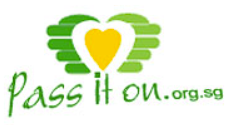
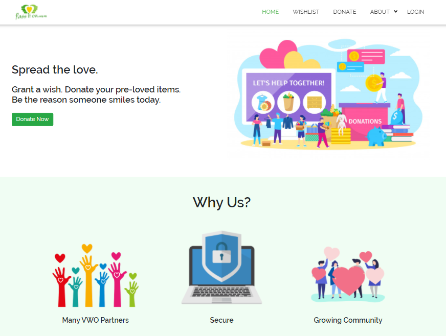
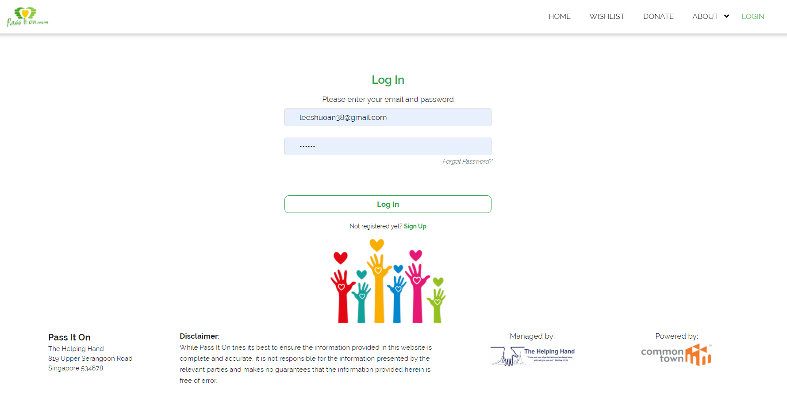
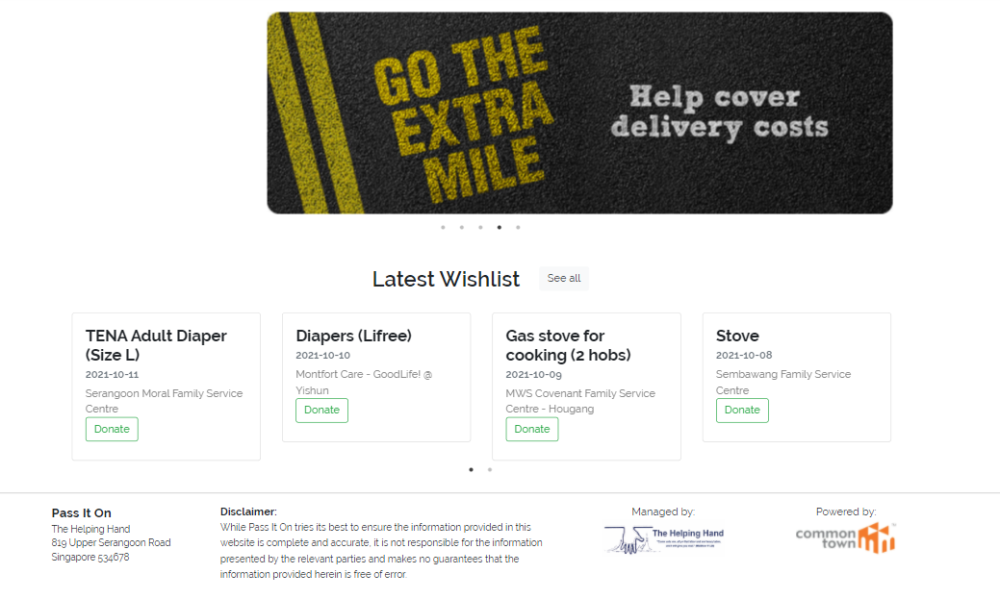
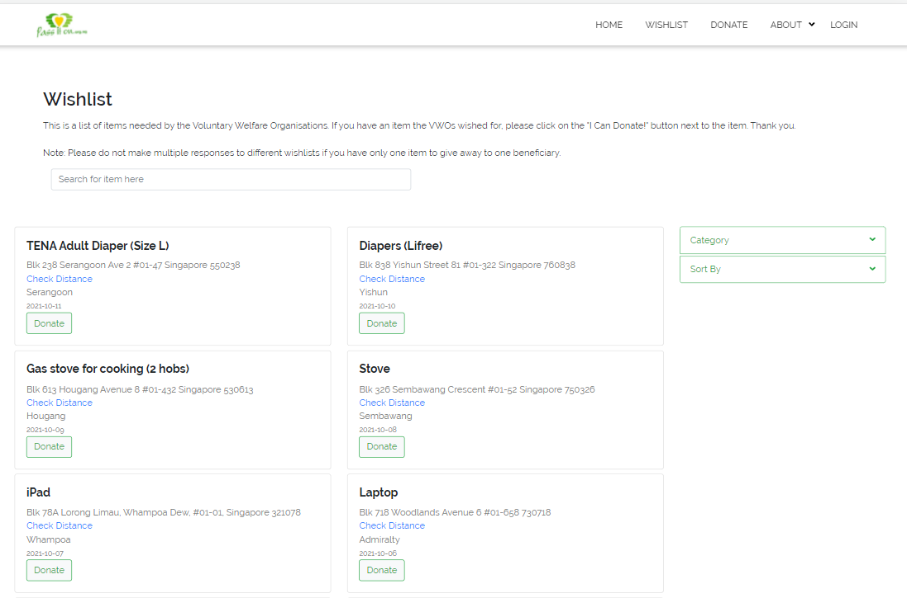
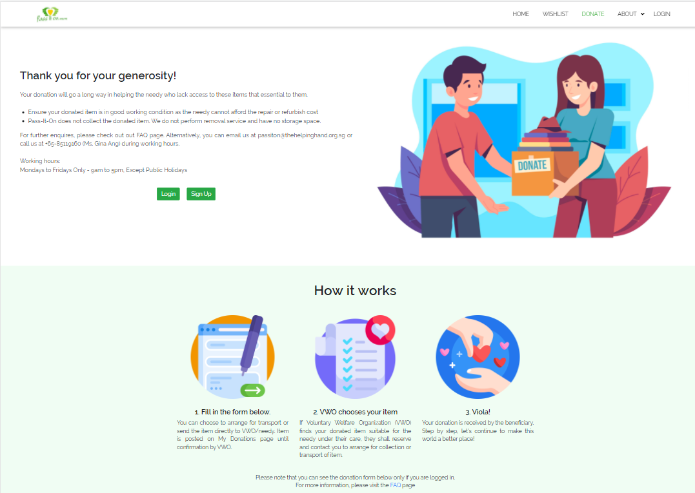
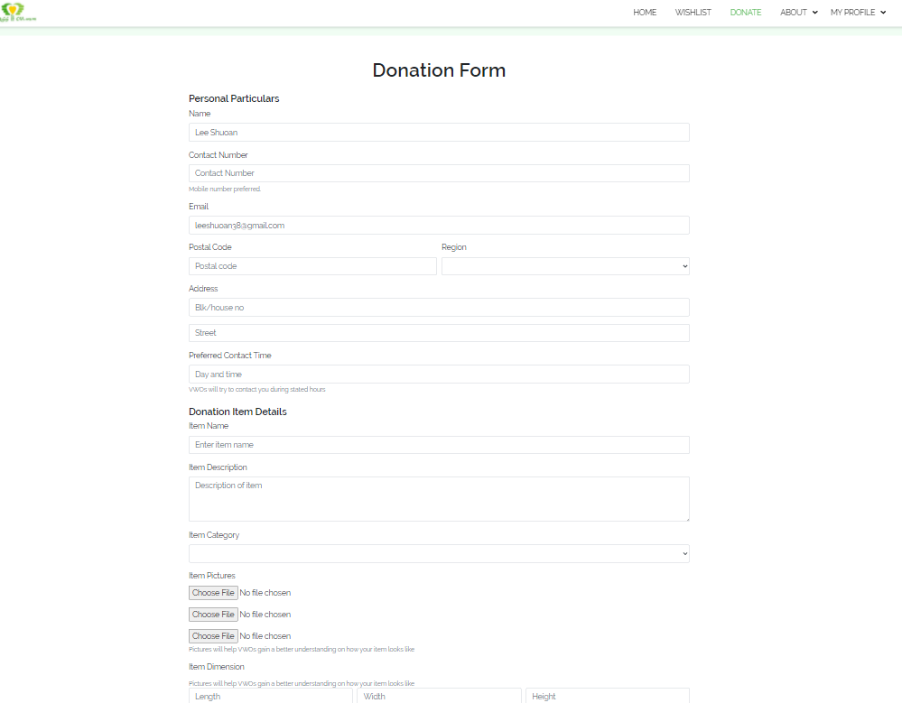
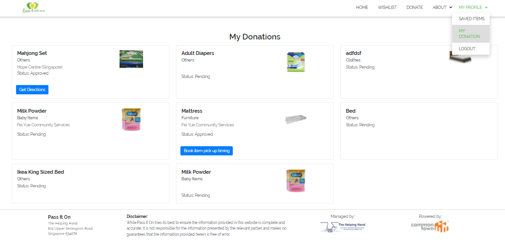
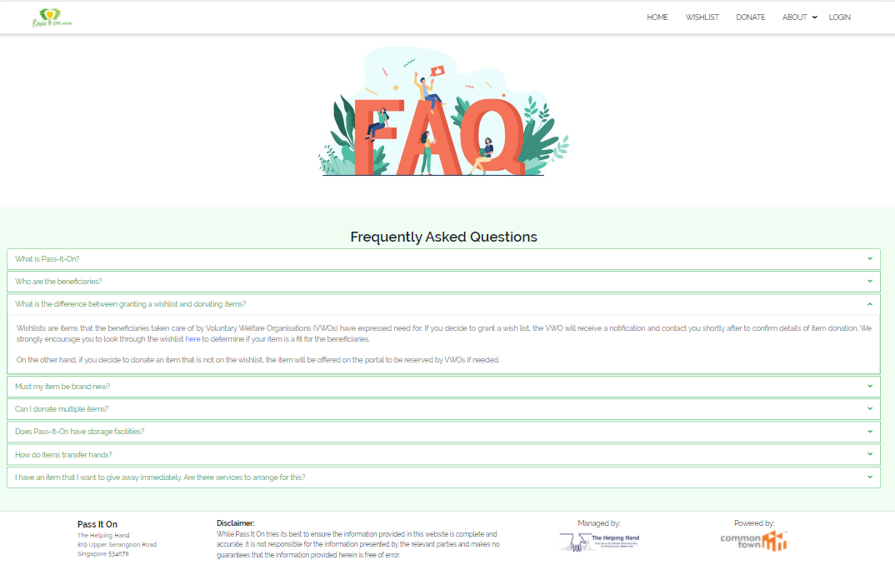

# :wave: is216-project

## 🤓 IS216 - Group 24 - Team Tam
* Lim Jie Min -  jiemin.lim.2019
* Ong Jhin Yee -  jhinyee.ong.2019
* Shaamini G - shaaminig.2019
* Lee Shuoan - shuoan.lee.2020
* Reyna Yeo Mui Kheng - reyna.yeo.2020
* Jeral Ong Sheng Ming - jeral.ong.2020


## 🤓 Project Overview ##
Our team has worked on an existing website, Pass-It-On (https://www.passiton.org.sg/), that’s handled by The Helping Hand. 
<br>


Pass-It-On connects the general public to the needy via Voluntary Welfare Organizations. Voluntary Welfare Organizations, also known as VWOs, are Family Service Centres and Senior Citizen Centres etc that take care of the needy. VWOs registered with Pass-It-On can request items that the beneficiary wants. These items are known as “wishes”, which are found in the Wish List. If the donor wishes to donate an item that's not on the wishlist, they can submit the item throught the donation form and VWOs who require the item will reserve it. 

Current issues with the existing website include: 
* :nauseated_face: **Unappealing aesthetics**- pictures on the site are overly small and of varying sizes, making the page look very messy and disorganised. Labels of some images cannot be seem as they are overlapped by the image
* 	:open_mouth: **Ineffective presentation of information** - Important information such as difference between wishlist and donation are not clearly explained, and confused users have to scout around the website to understand how Pass-It-On works exactly. The FAQ, which was supposed to answer important questions, has the entirety of its content capitalised. This is a huge deterrent for propective donors.
* 	:dizzy_face: **Confusing elements** -  it's confusing for the user when they expect to go back to the original item page when pressing the reset button after looking at items of the selected category. Users have to go press on item list navigation bar again to see the full list of items.

:sparkling_heart:  Motivations behind our project: <br>
:sparkling_heart: 
The onset of covid has greatly threatened the livelihoods of Singaporeans, with those underprivileged being those who are most vulnerable. They are a group of people who need assistance, one of which comes in the form of a donation, be it monetary or gifting of items. 

Lamentably, since 2020, fewer Singaporeans are making donations as the general public became more concerned about their own economic security, amongst other factors, and have less time and effort to help out the less privileged. A survey conducted by Toluna revealed that the percentage of Singaporeans willing to donate dropped nearly 33%, from 32% in April 2020 to 23% in July 2020.[^1] Reasons such as the lack of resources such as time and money were given. 

With this worrying trend in mind, our group feels that it is imperative to work on encouraging greater donation rates to help the underprivileged.

Specific target group and country: 
* Donors in Singapore who have items that are brand new or in working condition and would like to donate

System Architecture Diagram: 


Link to Figma: 
* https://www.figma.com/file/it7gYwCySs1lsDp8WQcrUq/WAD1?node-id=0%3A1

Workflow: 
* https://lucid.app/lucidchart/9bc3b041-9ac6-4c70-a388-5ff6d343e5ab/edit?viewport_loc=-3315%2C-4881%2C14970%2C5953%2CNuGrT-AcSr1r&invitationId=inv_27f29657-522e-4f3c-a3a0-1cd910e1cc29 


## 🤓 How to Install and Run Our Web Application (for Developers) ##
1. Install nodejs
    * To check if you have node installed run ```node --version``` in your terminal or command line
    
    * If you do not have node installed, you may install it through this [link](https://nodejs.org/en/download/)

2. Open the repository and enter the directory by running  ```cd web-app``` in the terminal


3. Run ```npm install``` to download the necessary dependencies


4. Run ```npm run dev``` to start a development environment. 

5. Visit [localhost:3000](http://localhost:3000/) to view the application. 

The steps above work for both Mac and Windows OS


## 🤓 How to Use Our Web Application (for Visitors to our Website) ##
* You can try using the following credentials to log in: <br>
email: leeshuoan38@gmail.com <br>
password: abc123
* Feel free to create your own account too!

### Welcome to Pass-It-On's new site! Be the reason why someone smiles today ###

1. Login/ Sign Up
    * Are you a new user? If you are, please **sign up**! A verification email will be sent to your email, so please remember to verify! 
    * If you are a returning user, do remember to login in order to access the donation form. 
    
2. Wishlist
    * Wishlist are items that VWOs have requested on behalf of the needy that they are taking care of. Please take a look at the wishlist and see if the item that you would like to donate is able to grant someone's wish.
    
    * Here, you can see the latest wishlist, all items in wishlist and filter it according to your preference!
    
3. Donate
    * Here, you can find a short explanation of how the donation process works. Some fields have been prefilled for your convenience! 
    
    * Also, we highly recommend paying for transport fees for donated items. Use the calculator for an estimated quote!
    
4. Waiting to see if your donated item has been accepted by a VWO? 
    * Look at the My Donations page under to see the status of your donations! You can only view this if you are logged in. 
    
5. Want to learn more about Pass-It-On?
    * Find out more about the story of Pass-It-On at the About Us page!
    
6. Anymore questions? 
    * Look at the FAQ page under the About Us tab! 
    

Thank you for your generosity!

## 🤓 Other Things ##
References: 
[^1]: Nabilah, A. (2020, August 25). Covid-19: Fewer Singaporeans donate, more charities close their doors. TODAYonline. Retrieved October 10, 2021, from https://www.todayonline.com/singapore/fewer-singaporeans-donate-more-charities-close-their-doors-nvpc. 

